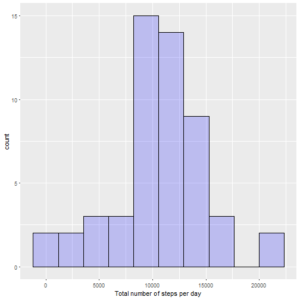
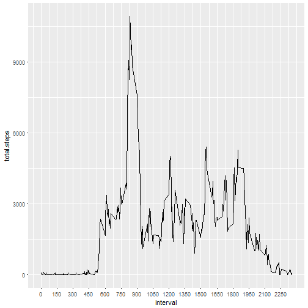
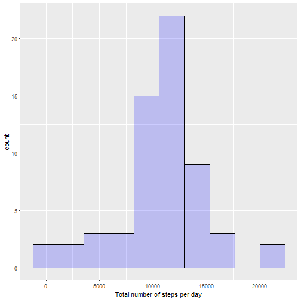
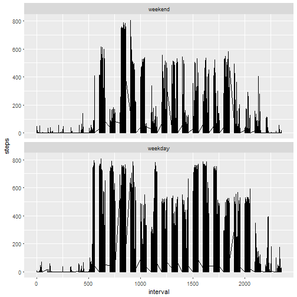

## Introduction

___________________________________________________

This Peer Review Assigment takes data from a personal activity monitoring device. The data was collected during two months (October and November, 2012) at 5 minute intervals throughout the day.

### Loading and preprocessing the data
The dataset can be downloaded [here](https://d396qusza40orc.cloudfront.net/repdata%2Fdata%2Factivity.zip). The cvs file can be loaded into R by (provided is in the working directory):


```r
activity <- read.csv("activity.csv")
```


The dataset has 17568 observations of 3 variables: steps, date, interval.

* **steps**: Number of steps taking in a 5-minute interval (missing
   values are coded as `NA`).

* **date**: The date on which the measurement was taken in YYYY-MM-DD
   format.

* **interval**: Identifier for the 5-minute interval in which
   measurement was taken.

### 1. Mean total number of steps taken per day

In order to find out the mean total number of steps taken per day ignoring `NA` values we need to:
i)  convert the date variable into Date format,
ii) aggregate the activity by date adding up the number of steps by day
iii) calculate the mean of the aggregated variable by day excludying `NA`s


```r
activity$date <- as.Date(activity$date)
stepsDay<- aggregate(activity$steps, by = list(activity$date),sum)
names(stepsDay) <- c("day", "total.steps")
meanDay <- round(mean(stepsDay$total.steps, na.rm = TRUE),0)
medianDay <-round(median(stepsDay$total.steps, na.rm = TRUE),0)
```

The mean  and median number of steps per day, ignoring `NA` values is: mean =10766, median = 10765 steps per day.

The data can be visualised in the form of a histogram of the total number of steps taken each day.


```r
qplot(stepsDay$total.steps, geom = "histogram", bins =10, xlab = "Total number of steps per day", fill = I("blue"), col = I("black"), alpha = I(1/5))
```




### 2. Average daily activity pattern

To find average daily activity patterns we group the data by interval accross the 61 days.


```r
activity$steps[is.na(activity$steps)]<-0
StepsInterval= aggregate(activity$steps, by = list(activity$interval), sum)
names(StepsInterval)<- c("interval", "total.steps")
```

A time plot series reveals that the 5-minute interval that contains the maximum number of steps is about 100

```r
StepsInterval$interval<- as.numeric(StepsInterval$interval)
ggplot(data = StepsInterval, aes(x= interval, y = total.steps, group=1))+ geom_line()+ scale_x_continuous(breaks = seq(0, 2355, 150))
```



This is confirmed by calculating the maximum number of steps across all periods


```r
maxnosteps <- row(StepsInterval)[StepsInterval == max(StepsInterval$total.steps)]
```

Hence, the 5-minute interval that contains the maximum number of steps accross all days is the interval 104

### 3. Imputing missing values

Notice that there are a number of days/intervals where there are missing values which may introduce vias into some calculations or summaries of the data.


```r
activity <- read.csv("activity.csv")
total.na <- sum(is.na(activity$steps))
```

There are a total of 2304 missing values in the dataset.

A simple strategy for filling in all of the missing values in the dataset can be devised by using the mean number of steps for each interval accross the days.

A new dataset with the `NA` values replaced with such mean number of steps per interval can be created.


```r
StepsIntervalmean= aggregate(activity$steps, by = list(activity$interval), mean, na.rm = TRUE)
names(StepsIntervalmean)<- c("interval", "mean.steps")
activity$steps <- replace(activity$steps, is.na(activity$steps), StepsIntervalmean$mean.steps)
activity$steps<-round(activity$steps,0)
```

Calculating the mean and median of the new data set...


```r
activity$date <- as.Date(activity$date)
stepsDay<- aggregate(activity$steps, by = list(activity$date),sum)
names(stepsDay) <- c("day", "total.steps")
NewmeanDay <- round(mean(stepsDay$total.steps),0)
NewmedianDay <-round(median(stepsDay$total.steps),0)
```


... we found that the mean with imputted values is 10766 which is equal to the mean calculated with omitted `NA` values. However, the  median differs slightly with imputted values from 10762 compared to 10765.

A new histogram can be produced with this dataset


```r
qplot(stepsDay$total.steps, geom = "histogram", bins =10, xlab = "Total number of steps per day", fill = I("blue"), col = I("black"), alpha = I(1/5))
```



### 4. Differences in activity patterns between weekdays and weekends.

To look for patterns we can identify if the day was a weekday or weekend. We can see that there are less number of steps at earlier and later time intervals for the weekends.


```r
weekdays1 <- c("Monday", "Tuesday", "Wednesday", "Thursday", "Friday")
activity$day <- factor((weekdays(activity$date)%in% weekdays1), levels = c(FALSE, TRUE), labels = c("weekend", "weekday"))
ggplot(activity, aes(activity$interval, activity$steps ))+ geom_line()+ facet_wrap(~ activity$day, ncol = 1)+ xlab("interval")+ ylab("steps")
```


